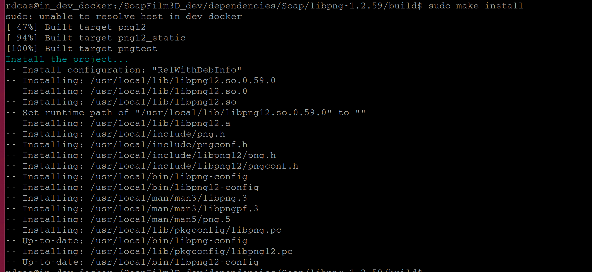
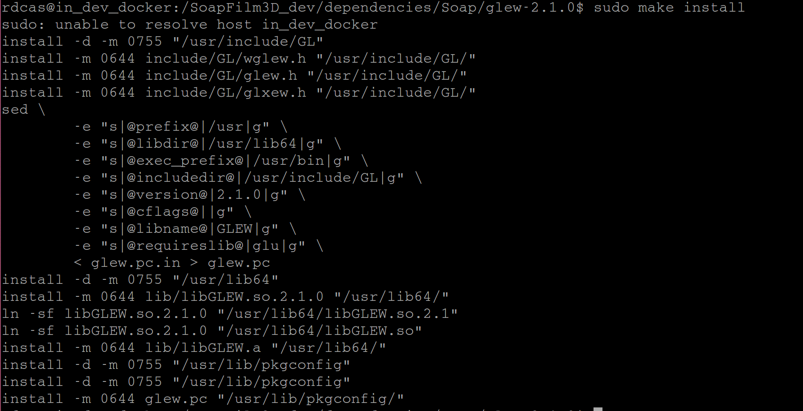

[](http://www.cs.columbia.edu/cg/doublebubbles/)

SoapFilm3D is an open source project for the physical simulation of soap films and bubbles. It is cross-platform (Mac OS X, Linux, Windows, and more), and licensed under the Mozilla Public License v. 2.0.

We would like to hear from you if you appreciate this work.

The repository contains the test program accompanying the paper by Da et al., including the multimaterial mesh-based surface tracking library LosTopo. It also includes the curvature computation proposed in the article by Fei et al. 

This program is built by standard procedures using CMAKE (http://www.cmake.org).

Dependencies
--------------------
The following external libraries are required:

* Eigen (http://eigen.tuxfamily.org)
* OpenGL and GLUT (http://www.opengl.org/resources/libraries/glut/)
* LAPACK (http://www.netlib.org/lapack/)
* BLAS (http://www.netlib.org/blas/)
* libPNG (https://libpng.sourceforge.io/)
* zLib (https://www.zlib.net/)
* GLEW (http://glew.sourceforge.net/)

On Mac OS X or Linux-based systems, most of the dependencies are either included, or can be easily installed with Homebrew (https://brew.sh) or the APT package handling utility. 

On Windows you may need manually download and install some of them.

Compilation
-----------------
SoapFilm3D has been tested with Clang (under Mac OS X), and GCC 4.8+ (under Linux). Currently the MSVC compiler is partially supported without the FMMTL module.

To compile SoapFilm3D, you'll need CMake on Mac OS X or Linux.

1. make a directory, say, *build*, with *mkdir build*, enter the *build* directory, type *cmake ..*
2. Optionally you can adjust the options with *ccmake .*
3. type *make* to compile the code. For speeding up the compilation process you may use *make -j*.

On Windows:

1. open CMake-GUI, enter the correct directory for source code and build. Then click *Configure*, choose your installed version of the Microsoft Visual Studio.
2. after configuration you may find several libraries not found (with notifications of errors), check the *Advanced* box and *specify those missing header path and libraries manually*. For example, if Eigen is missing, then please specify the EIGEN3_INCLUDE_DIR to the path of directory we provided. For the ones we have not provided, you need to download and compile them, and then specify the missing directories to the path containing your headers or compiled libraries. Please make sure you have picked the libraries corresponding to the architecture you have selected (say, 32-bit libraries for x86, and 64-bit libraries for x64).
3. click generate after fixing all missing variables to generate your Visual Studio solution.
4. open the Visual Studio solution and compile the code.
5. before running the demo, all the compiled dynamic linking libraries (DLLs) for your dependencies should be accessible from your PATH environment variable that can be changed in system settings, or you may simply copy them into your System32 (x64) or SysWOW64 (x86) directories.

Since collecting and compiling the dependencies could be tricky for Windows, we provided some compiled libraries and DLLs for your convenient. You may find them in the zip file under the bin folder, which also contains a compiled executable (under Visual Studio 2015 and Windows 10). 

Run the Demo
--------------------
Running the executables without command line arguments will display usage
information. All the data files for testing are located in the assets folder.
Since FMMTL is not supported on Windows, running can be slower than expected.

Please run the code using the project folder that containing everything (assets, code, etc.) as the working directory. 

Citations
--------------------
Da, Fang, et al. "Double bubbles sans toil and trouble: Discrete circulation-preserving vortex sheets for soap films and foams." ACM Transactions on Graphics (TOG) 34.4 (2015): 149. (http://www.cs.columbia.edu/cg/doublebubbles/)

Da, Fang, Christopher Batty, and Eitan Grinspun. "Multimaterial mesh-based surface tracking." ACM Trans. Graph. 33.4 (2014): 112-1. (http://www.cs.columbia.edu/cg/multitracker/)

Fei, Yun (Raymond), et al. "Addressing Troubles with Double Bubbles: Convergence and Stability at Multi-Bubble Junctions." arXiv preprint arXiv:1910.06402 (2019). (https://arxiv.org/abs/1910.06402)


############
In order to properly install the dependencies, more libs should be pre-install.
## freeglut:
How to build freeglut on UNIX
-----------------------------
- Make sure you have cmake installed. Examples:
  - Debian/Ubuntu: apt-get install cmake
  - Fedora: yum install cmake
  - FreeBSD: cd /usr/ports/devel/cmake && make install
  Or directly from their website:
  http://www.cmake.org/cmake/resources/software.html
- Make sure you have the basics for compiling code, such as C compiler
  (e.g., GCC) and the make package.
- Also make sure you have packages installed that provide the relevant
  header files for x11 (including xrandr) and opengl (e.g.,
  libgl1-mesa-dev, libx11-dev and libxrandr-dev on Debian/Ubuntu).
- Install XInput: libxi-dev / libXi-devel
- Run 'cmake .' in the freeglut directory to generate the makefile.
- Run 'make' to build, and 'make install' to install freeglut.
- If you wish to change any build options run 'ccmake .'


## zlib


## libPNG



## LAPACK
gfortran is needed to build LAPACK

```bash
sudo apt-get install gfortran
```

AND this line is added into the CMakeLists.txt of this project.

```c++
############add Fortran
set(CMAKE_Fortran_COMPILER /usr/bin/gfortran)
```


## BLAS

```
sudo apt-get install libblas-dev
sudo apt-get install liblapack-dev
```

## GLEW

### Build

It is highly recommended to build from a tgz or zip release snapshot.
The code generation workflow is a complex brew of gnu make, perl and python, that works best on Linux or Mac.
For most end-users of GLEW the official releases are the best choice, with first class support.

#### Linux and Mac

#### Using GNU Make

##### Install build tools

Debian/Ubuntu/Mint:    `$ sudo apt-get install build-essential libxmu-dev libxi-dev libgl-dev libosmesa-dev`

RedHat/CentOS/Fedora:  `$ sudo yum install libXmu-devel libXi-devel libGL-devel`

##### Build

	$ make
	$ sudo make install
	$ make clean

Targets:    `all, glew.lib (sub-targets: glew.lib.shared, glew.lib.static), glew.bin, clean, install, uninstall`

Variables:  `SYSTEM=linux-clang, GLEW_DEST=/usr/local, STRIP=`

_Note: may need to make **auto** folder_



## Install boost

```bash
$ sudo apt install libboost-dev
$ sudo apt install libboost-all-dev
```

